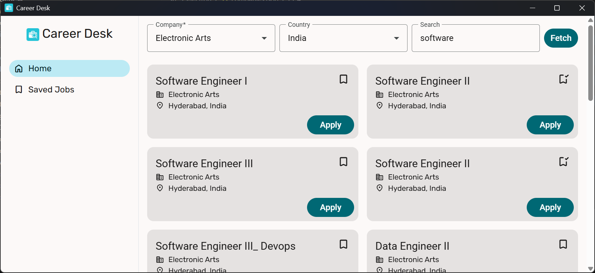

# Career Desk
A desktop app built with Electron + Angular to help you search, scrape, and manage job postings from top company career sites.

<p align="center">
  
</p>


The app lets you:

- 🔎 Search jobs from supported companies (NCR, Verizon, etc.)

- 📌 Save jobs locally for later reference

- ✅ Track applied jobs

- ⚡ Store everything offline in JSON files (no cloud needed)


## 🚀 Features

- Scrape job listings from Workday, Verizon, and more

- Search with query & filters

- Save and unsave jobs

- Track applied jobs

- Clean Material 3 UI built with Angular signals & zoneless change detection

## 🛠 Tech Stack

- Frontend: Angular 18 + Angular Material 3

- Desktop Runtime: Electron

- Scraping: Axios + Cheerio

- Persistence: Node.js FS (JSON storage)

## ⚡ Usage

1. Open Career Desk.

2. Select a company and enter your search query.

3. Browse results and:

    - Click Apply → opens job posting in your browser.

    - Click Save → toggles save/unsave for local storage.

## ⚙️ Development

To run the app in development mode:

```
# Start Angular frontend with live reload
npm run angular-start

# In a separate terminal, start Electron
npm run electron-start
```

## 🏗️ Build

To build the full Angular + Electron application for distribution:

```
npm run electron-package
```

## 🤝 Contributing

Contributions are welcome! Open an issue or submit a PR to suggest new scrapers or features.